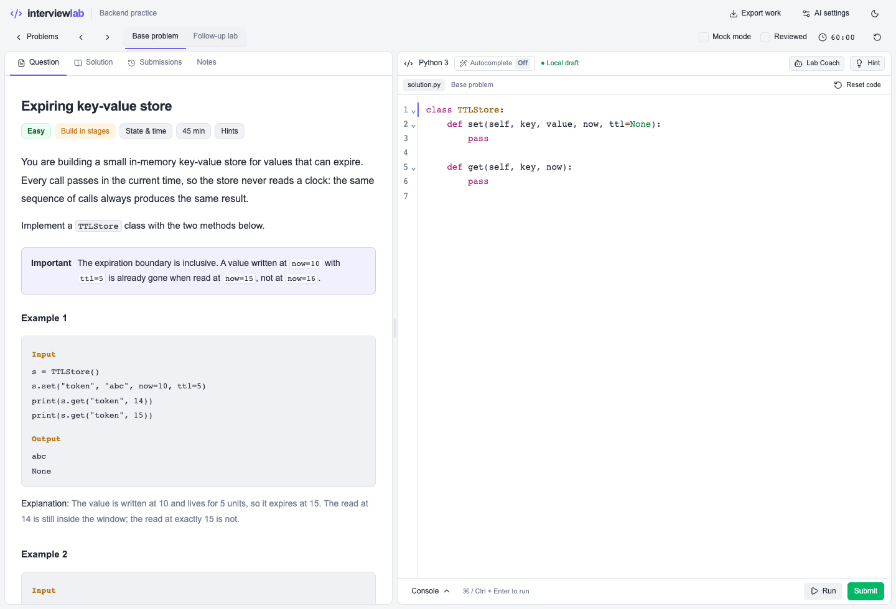

# Backend Interview Lab

Practice backend engineering in a browser: write Python, run tests locally in WebAssembly, work through system design scenarios, and ask an optional AI coach for feedback.



The lab includes 29 Python problems and 29 follow-up labs, 253 test groups, and 18 system design scenarios. Progress, notes, and submissions stay in browser storage. Export your work as JSON before clearing it.

## Run locally

Use Node.js 22.13 or newer and npm. No database or API key is needed for the exercises.

```sh
git clone https://github.com/arkravitz/backend-interview-lab.git
cd backend-interview-lab
npm ci
npm run dev
```

Open the local URL printed by the server. Pick a problem, edit its starter code, choose Run or Submit, and inspect the result. Reference solutions are available outside mock mode. On macOS, `Start Interview Lab.command` starts the same server.

For optional coaching, open AI settings and supply your own DeepSeek key. The key persists in localStorage until you choose Forget key; it is excluded from work exports. Explicit coaching actions send your selected assignment and work to DeepSeek. The server forwards the key for that request and does not persist it. Paid inference is optional and is mocked in tests.

## Engineering decisions

- Python runs in a dedicated Pyodide worker. A deadline and Stop terminate runaway work; there is no server-side Python execution endpoint. Browser workers are not an adversarial-code security sandbox.
- Suggested AI edits must match a unique range of the current code. Stale, ambiguous, and overlapping edits are rejected; accepted edits have guarded undo.
- Shared API handling validates origin, credentials and request shape, caps bytes actually read, and propagates cancellation and provider errors.
- Drafts and submission snapshots have different lifecycles. System design completion and rubric score are also independent.

The UI uses React, TypeScript, CodeMirror and Tailwind. The server uses **vinext with Vite and Cloudflare Workers tooling**, despite the familiar `app/` directory. It does not depend on Next.js. Build output is `dist/client` and `dist/server`.

## Verify

```sh
npm test
npm run lint
npm run build
npm run typecheck
npm run test:styles
```

`npm test` runs unit regressions and every exercise solution/example using the same bundled Python runner as the browser. CI also runs browser regressions with isolated browser contexts and mocked inference.

To run browser checks against an already running development server:

```sh
python3 -m venv .qa-venv
.qa-venv/bin/pip install -r tests/requirements.txt
.qa-venv/bin/python -m playwright install chromium
LAB_URL=http://localhost:3000 .qa-venv/bin/python -m unittest discover -s tests -p 'browser*.py' -v
```

Each test uses a fresh browser context and mocked inference. Tests do not access your existing drafts or API key.

## Scope and attribution

Built with AI coding assistance. This repository documents implementation choices and tests so that the generated code can be inspected and reproduced.

Original coding and system design exercises for general backend interview practice. The library is alphabetical, with filters for topic and progress.

Application code is MIT licensed. Bundled Pyodide, CPython and UI components retain their upstream notices in [THIRD_PARTY_NOTICES.md](THIRD_PARTY_NOTICES.md) and `licenses/`.
